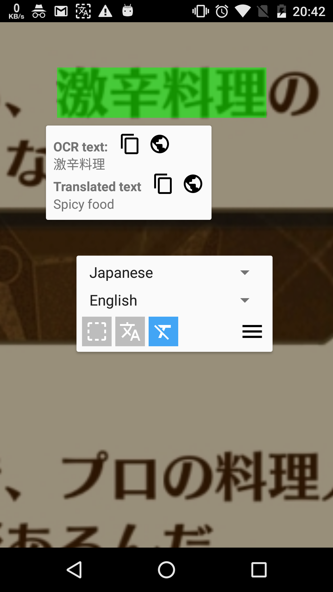
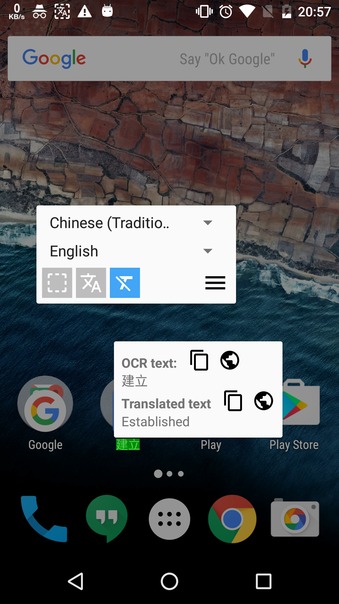

# Ever Translator
</img>

Translate any text on screen, even in games!

</img>
</img>
</img>

# Feature
>- Translate any text without exit current app.
>- Translate any uncopyable text
>- Translation any time!

**If you get any crash, please click the report button instead of close button, thanks! **

# Project dependency
firemaples/microsoft-translator-java-api
https://github.com/firemaples/microsoft-translator-java-api

# Todo_ list
Language list - support multi-language

# Thanks for
rmtheis/tess-two
https://github.com/rmtheis/tess-two

boatmeme/microsoft-translator-java-api
https://github.com/boatmeme/microsoft-translator-java-api

JohnPersano/SuperToasts
https://github.com/JohnPersano/SuperToasts

crashlytics
http://try.crashlytics.com/

http://binwaheed.blogspot.tw/2015/03/how-to-correctly-take-screenshot-using.html
