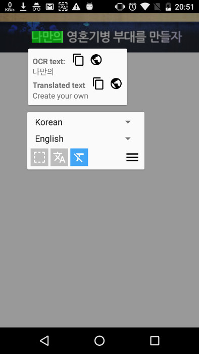

# EverTranslator [](https://badge.fury.io/gh/firemaples%2FEverTranslator) [](https://github.com/firemaples/EverTranslator/actions/workflows/ci.yml)

<a href="https://play.google.com/store/apps/details?id=tw.firemaples.onscreenocr">
  
  
</a>

Translate any text on screen, even in games!

<a href="https://www.youtube.com/watch?v=Y0OjF-luuDE">Watch usage guide on Youtube</a>

<p>
  
  
  
</p>

## Features

 - **Recognize** any text on the screen.
 - **Translate** the recognized text.
 - **Copy** the recognized text or translated text.
 - **Read out** the text. (temporarily removed)

## Requirement

Android 5.0 (API level 21) or above.

## Get the app

### Download it on Google Play

<a href="https://play.google.com/store/apps/details?id=tw.firemaples.onscreenocr">
  
</a>

### Build from source

#### Environment requirements

- Android SDK
- Android Studio (optional)

#### Produce APK by command line

1. Create a local file `./local.properties` and put your Android SDK path to it as `sdk.dir=path to SDK`, or simplily <a href='#open-project-in-android-stuido'>open the project with Android Studio</a>, it will automatically create the required file for you.
1. Assemble APK file by ```./gradlew clean assembleDevDebug```
1. You can find the APK file on `main/build/outputs/apk/dev/debug/main-dev-debug.apk`
1. Install debug APK to your phone by ```adb install -r -t main/build/outputs/apk/dev/debug/main-dev-debug.apk```

#### Open project in Android Stuido

1. Open the project's root folder by Android Studio, the application module is the `main` folder.
1. You can simplily build and run application by the built-in buttons in Android Studio.

#### Flavors

- **Dev** for development
- **Prod** for releasing to Google Play

## Contact

If you encounter a bug, please open an issue.  

For general questions, you can also open an issue or send an email firemaples@gmail.com.
