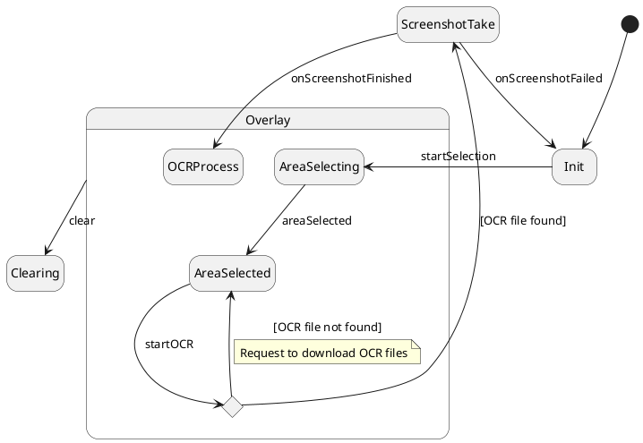

https://github.com/shd101wyy/markdown-preview-enhanced
https://plantuml.com/state-diagram

```puml
@startuml

hide empty description

state Init

state Overlay {
    state AreaSelecting
    state AreaSelected
    state ocrFileExist <<choice>>

    state OCRProcess
}

state ScreenshotTake


state Clearing

[*] --> Init

Init --> AreaSelecting : startSelection
AreaSelecting --> AreaSelected : areaSelected
AreaSelected --> ocrFileExist : startOCR
ocrFileExist --> ScreenshotTake : [OCR file found]
ocrFileExist --> AreaSelected : [OCR file not found]
note on link
    Request to download OCR files
end note

ScreenshotTake --> OCRProcess : onScreenshotFinished
ScreenshotTake --> Init : onScreenshotFailed

Overlay --> Clearing : clear

@enduml
```